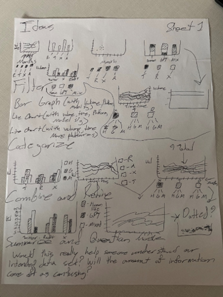
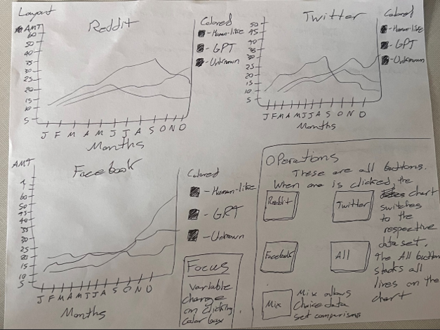
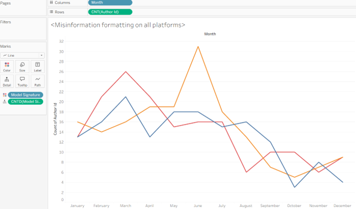
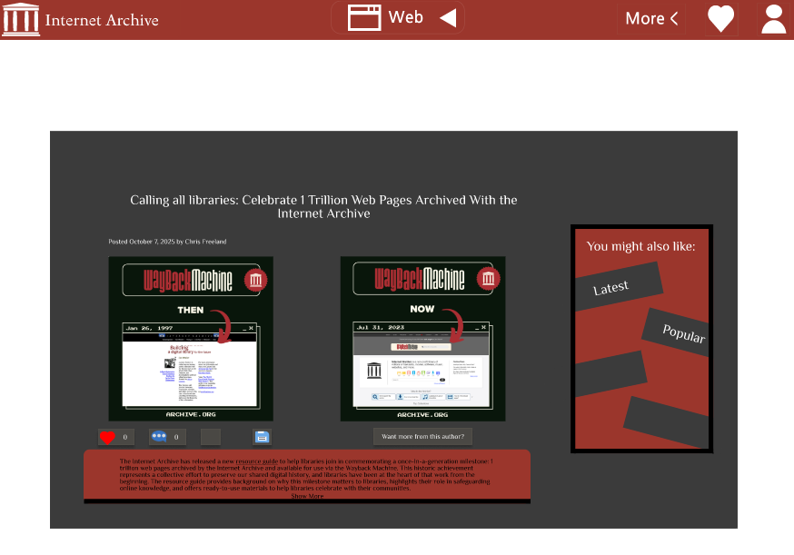
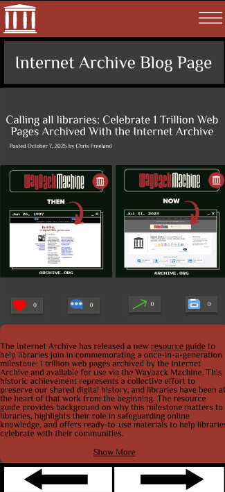
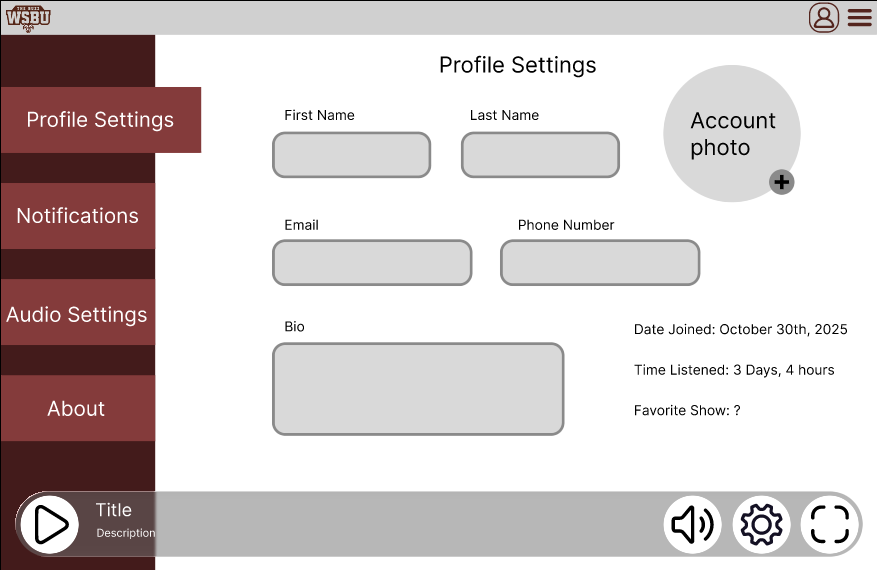
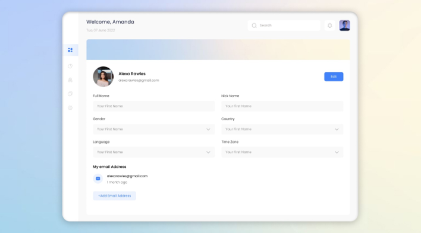

# User Experience Manifesto
### Introduction
Within every created website, device, and application, many methods are involved before the end design goal. Design methods are important because they provide a structured and systematic approach to solving problems. By following processes such as research, prototyping, and testing, designers can make proper decisions rather than relying on guesswork. These methods are used to help identify user needs, technical constraints, and potential risks early in the process. This leads to a reduction in costly errors and redesigns later in the process. Design methods rely on collaboration and clear communication so that designers and stakeholders can always be on the same page.

During the User Experience course, we learned many different methods pertaining to the philosophy of design. Over the course of the semester, we redesigned applications, designed our own applications, and visualized data. Without design methods to aid me, these projects would have been a difficult process. In this manifesto, I will review 5 of the most important methods that I used for designing and why they’re so important. 

### Prototyping 
Prototyping is an effective design method because it turns ideas into visible and testable forms that reveal how a design would work in practice. By interacting with a prototype, designers can identify usability issues, and design flaws early. It is important to catch them early since changes are easier and less costly to make. Prototyping also involves iteration and clear communication. This allows designers to base their ideas on real user feedback and align stakeholders with the hypothetical design.

Prototyping has helped me in almost every assignment I’ve done for this class since it allows ideas to flow and helps with my visualization. A project that really benefitted from prototyping was our design for understanding project. This project involved finding a dataset and representing that data using charts. Early in the process we used a 5-step method of prototyping called the fdS approach. The 5 steps were idea making, filtering, categorizing, refining, and summarizing/questions. 

**fdS approach**

For this specific lab, I compared misinformation in AI chat bots. This chart helped me steadily realize what designs I wanted to go with for my graphs. Eventually, we moved onto larger prototypes. While still on paper, they were more complete than the past design sheet.

**Fleshed out prototype**

This is an example of one of the graphs prototypes I envisioned. It shows the separate platforms graphs, the possible buttons involved, and the graph key. After getting a concrete idea of what I wanted this to look like, I used  Tableau to bring it to life.

**Completed graph**

This graph shows the combination of all platforms and the number of entries compared to the months it occurred. Overall, this lab took many steps in the prototyping process. Although it seems like a lot, it was necessary to find a direction that works best.

### Interviews 
Interviews are a valuable design method because they provide direct insight into users’ needs and experiences. Open-ended questioning and follow-up discussion allows designers to uncover problems, expectations, and contextual factors. Through observation alone, these issues may not be uncovered. This understanding helps ensure that design decisions are grounded in real user perspectives rather than assumptions.

During our Identifying needs project, I decided to interview 2 people about the broken washing machine in one of the townhouses on campus. This project was an exercise to introduce us to interviewing for potential designs, so it never actually led to a larger design. That aside, through interviewing I was able to understand the affects that the broken washing machine cause. Talking face to face let me see the day-to-day issues that these people dealt with. This information is crucial for further design since it gives a direction to go in. 

### Think alouds
“Think alouds” are essentially interviews while someone interacts with a design. They are useful because they expose users’ thought processes as they interact with the design. Through listening to users’ reasoning and confusion, designers can identify usability problems and issues with the systems structure. This method provides immediate feedback that supports more user-centered designs.

During our Re-Design project we had to use an existing website or application and attempt to improve some of its pages. For this project, I chose Internet Archive to be re-designed. After being satisfied with my initial prototyping, I decided to have some friends do a think aloud on the prototypes. After seeing some confusion on certain designs, I adjusted my designs on the finished product. An example of a changed design was the Blog Page.

**Original Design**

Originally, I was told that there was too much empty space and that the suggestions tab didn’t fit with page design. Taking this into account, I then redesigned the page.

**Final Design**

The final design turned out to be more compact. By removing unnecessary parts and space, it looks better as a whole. Without the assistance of a think aloud, I wouldn’t have known about the issues of my previous design.

### Contextual Inquiry
Contextual inquiries are great design methods because they allow designers to observe and understand users in their natural environment while they perform tasks. By combining observation with guided questioning, designers gain important insight into design. Behaviors and constraints that users may not mention in interviews or recall accurately can appear in contextual inquiries. This method also reveals how context such as physical surroundings or time pressures can influence user behavior. This leads to a deeper and more accurate understanding of user needs.

The project where I used contextual inquiries the most was my project on preliminary needs identification. During this project I chose to run a contextual inquiry on an ordering machine in the dining hall. By going through different people’s ordering habits, I was able to see issues with the ordering process. One interesting insight I discovered was that people could only input one item at a time in the machine. Even if someone wanted multiple custom orders, they would have to individually input each item. This caused frustration since it wasted time and got tedious if someone were to order multiple items. 

### Comparing other designs
Comparing a design with existing solutions is beneficial because it helps designers recognize best practices and areas for improvement. By analyzing what works and what does not in other designs, designers can make informed decisions. This can lead to avoiding repeating mistakes and find opportunities for innovation. This method ensures that new designs are effective and aligned with user expectations.

When designing and prototyping for the Buzz project, I used this technique frequently. Since so many other websites are already made like this specific application, many of the pages commonly seen could be found online. An example of this is the settings page. Most websites have nearly identical settings pages since they all typically contain the same information.

**Profile Settings for the Buzz design**

**Example profile settings**

In practice, I took a profile settings page that I found off Google. I took some similarities like profile picture and name, then adding them as features to my site. I kept the same format, such as rounded boxes for information entry.
